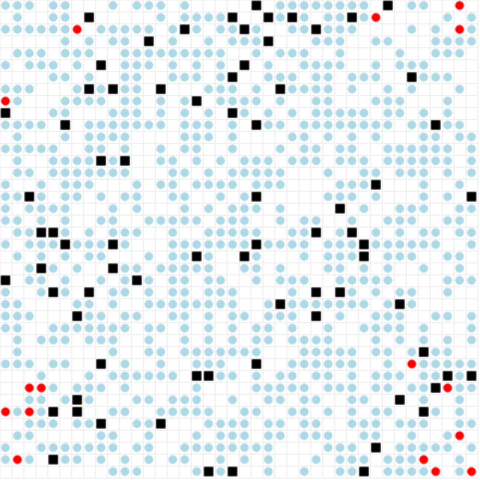
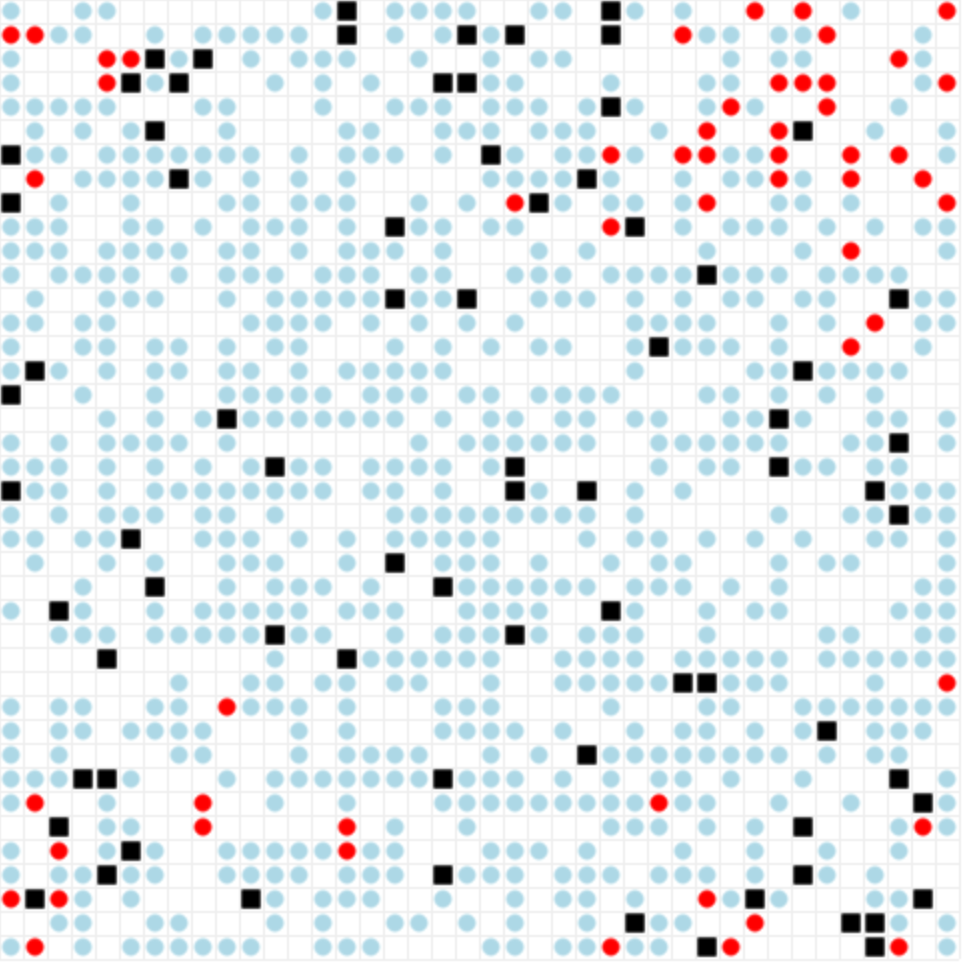
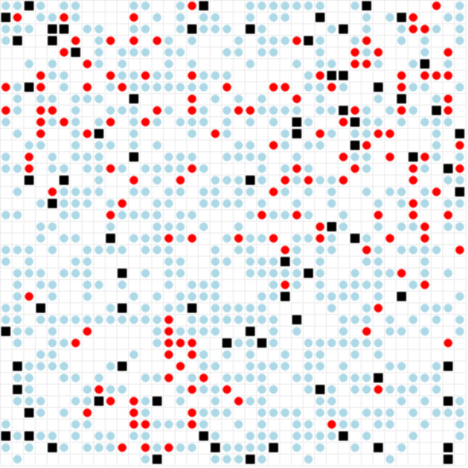

# Civil violence with social network model

##  How to run a demonstration

### Packages required

```
mesa = "~=0.8.8"
networkx = "~2.5"
pandas = "~=1.1"
numpy = "~=1.19"
matplotlib = "~=3.3"
seaborn = "~=0.11"
jupyter = "~=1.0"
ipynb = "~=0.5"
salib = "~=1.3"
```

### Ready-to-use

A ready-to-use demonstration is available, in command line, by running the command:
```
python3 server.py
```

It will open an example of civil violence with social network ABM in web inteface, using the default configuration file.


### Personalized

The configuration files (./configurations/*.json) enforce fixed parameters which can't be updated in the web interface by the user.
Therefore, if the user wan't to have full control of the ABM, he should update the default configuration file 
(./configurations/default.json) and remove the fixed parameters he want to manipulate.

## Screenshots

<p float="left">
    
    
    
</p>

## Architecture of the project

### ABM model
- server.py :Mesa server, set-up the ABM. Define the user-controlled parameters, interactive figures in the web 
interface and configuration used.
- civil_violence_model.py: Implementation of civil violence with social networks model. Define the attributes used by 
the model, the schedule (agent steps + update of attributes), methods to control agents on the model (add, remove, etc) 
and data collection methods for the model and agents during the simulation.
- civil_violence_agents.py: Implementation of agents used by civil violence model. This file contains definition of 
states attributes and actions of the civilian/influencer and cop agents.
- graph_utils.py: Implementation of social networks. Define different graph type, add model agents to graph, 
print method, etc.
- utils.py: Various function utilities used in the code base: read archived data, count, stats, 
color code converter, etc.
- graphics_portrayal.py: Define portrayal of agent, networks, etc. which will be visualized in the web interface.
- constant_variables.py: Constants shared by multiple algorithms in the codebase: shape, color, types, etc.
- configurations/: Configuration files used to fix parameters (user-controlled parameters set in this file can't 
be change by the user)


### Analysis & Experiments

- batchrunner_mp.py: This local class overwrite BatchRunnerMP class provided by mesa. 
It resolves the bug making not possible to use "run_all" method for sensitivity analysis.
- ofat_mp.py: One-factor-at-a-time (OFAT) sensitivity analysis of civil violence model with network (no bias).  Work 
with multiprocessing.
- ofat_plot.py: Function to load ofat archived data and plot the analysis results
- ofat_post_processing.py: Additionnal processing of the ofat data to get statistics on outbreaks 
(peak height, duration, frequency, etc.)  
- sobol_mp.py: Sobol sensitivity analysis of civil violence model with network (no bias). Implemented to 
handle multiprocessing.
- sobol_plot.py: Function to load sobol archived data and plot the analysis results
- experiment_1.py: Generates data which are used for comparison of network topology influence on civil violence model.
- figure.py: Analysis of Erdos Renyi, Watts Strogatz and Barabasi alber graph topologies. Study cluster coefficient 
and degree distribution.
- jupyter_notebook/statistical_analysis: Statistical analysis of ABM data.
- archives/: Data from sensitivity analysis are archived in this directory.
- output/: Results from experiments are archived in this directory.

## Earlier work

Some earlier work reviewed before working on this implementation involve: 
- civil violence with propaganda agent model: https://github.com/fabero/Civil-Violence-Modelling-A05
- original epstein model: https://github.com/projectmesa/mesa-examples/tree/master/examples/EpsteinCivilViolence

We highlights that that color converter from fabero repository was re-used un-touch in our project (see utility file)
to get gradient color for our grievance canvas element.

Suggestions from https://github.com/projectmesa/mesa/issues/787 helped us as well to fix BatchRunnerMP mesa class in
our project.


